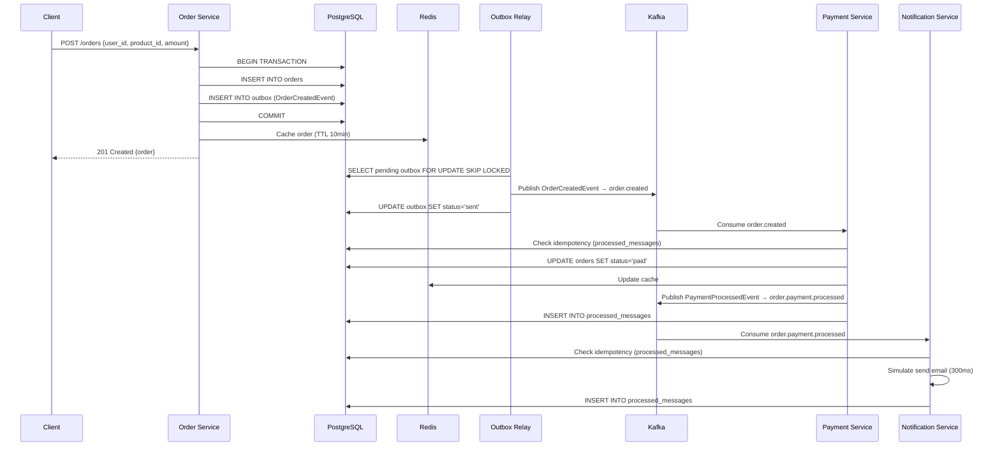
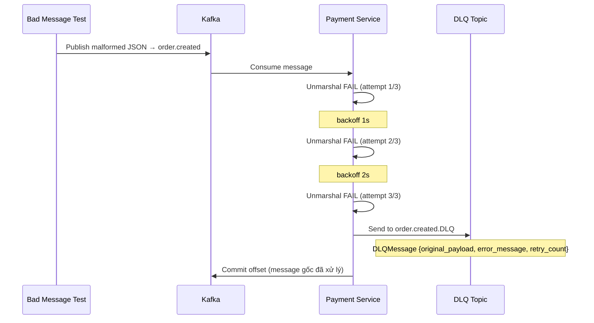
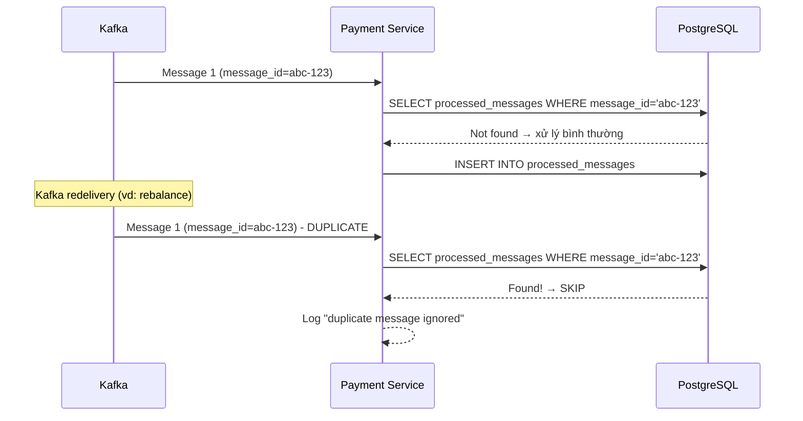

# Order Processing System — Kafka + Golang Demo

Hệ thống xử lý đơn hàng microservices, sử dụng **Apache Kafka** làm message broker, demo các kiến thức Kafka quan trọng trong kiến trúc event-driven bằng Golang.

---

## Kiến trúc hệ thống

```
┌──────────────┐     HTTP (POST /orders)      ┌──────────────────────────────────────────┐
│              │ ────────────────────────────▶ │              Order Service               │
│    Client    │                               │                                          │
│              │ ◀──────────────────────────── │  Gin HTTP API (:3000)                    │
└──────────────┘     JSON Response             │  ┌──────────┐  ┌─────────┐  ┌────────┐  │
                                               │  │PostgreSQL│  │  Redis  │  │ Outbox │  │
                                               │  │ (source  │  │ (cache) │  │ Table  │  │
                                               │  │ of truth)│  │         │  │        │  │
                                               │  └──────────┘  └─────────┘  └────┬───┘  │
                                               └──────────────────────────────────┼──────┘
                                                                                  │
                                          ┌───────────────────────────────────────┘
                                          ▼
                               ┌──────────────────────┐
                               │    Outbox Relay      │  Poll outbox table mỗi 2s
                               │                      │  FOR UPDATE SKIP LOCKED
                               │  Publish event ──────┼──────────────┐
                               │  lên Kafka           │              │
                               └──────────────────────┘              │
                                                                     ▼
                                                          ┌──────────────────┐
                                                          │   Apache Kafka   │
                                                          │                  │
                                                          │ Topics:          │
                                                          │ • order.created  │
                                                          │ • order.created  │
                                                          │   .DLQ           │
                                                          │ • order.payment  │
                                                          │   .processed     │
                                                          │ • order.payment  │
                                                          │   .processed.DLQ │
                                                          └────┬──────┬──────┘
                                                               │      │
                              ┌────────────────────────────────┘      └───────────────────────────────┐
                              ▼                                                                       ▼
               ┌──────────────────────────────┐                                    ┌──────────────────────────────┐
               │      Payment Service         │                                    │    Notification Service       │
               │                              │                                    │                              │
               │  Consumer Group:             │                                    │  Consumer Group:             │
               │  payment-service-group       │                                    │  notification-service-group  │
               │                              │                                    │                              │
               │  Consume: order.created      │                                    │  Consume:                    │
               │  Produce: order.payment      │                                    │  order.payment.processed     │
               │           .processed         │                                    │                              │
               │                              │                                    │  Gửi email giả lập           │
               │  Xử lý thanh toán (90%       │                                    │  (thành công / thất bại)     │
               │  success, 10% fail)          │                                    │                              │
               │                              │                                    │  Idempotency:                │
               │  Idempotency:                │                                    │  processed_messages table    │
               │  processed_messages table    │                                    │                              │
               │                              │                                    │  DLQ:                        │
               │  DLQ: order.created.DLQ      │                                    │  order.payment.processed.DLQ │
               │  Retry: 3 lần + backoff     │                                    │  Retry: 3 lần + backoff     │
               └──────────────────────────────┘                                    └──────────────────────────────┘
```

---

## Cấu trúc thư mục

```
go_kafka/
├── cmd/
│   ├── order-service/           # REST API tạo/tra cứu đơn hàng (Gin)
│   ├── outbox-relay/            # Poll outbox table → publish lên Kafka
│   ├── payment-service/         # Consumer: xử lý thanh toán
│   ├── notification-service/    # Consumer: gửi thông báo
│   ├── kafka-topic-init/        # Tạo sẵn Kafka topics
│   └── kafka-bad-message-test/  # Gửi message lỗi để test DLQ
├── internal/
│   ├── cache/                   # Redis cache layer
│   ├── config/                  # Cấu hình từ environment variables
│   ├── database/                # Kết nối PostgreSQL (GORM)
│   ├── domain/                  # Domain models & events
│   ├── handler/                 # HTTP handlers (Gin)
│   ├── kafka/                   # Producer, Consumer, Topic Admin
│   ├── outbox/                  # Outbox Relay (poll & publish)
│   ├── repository/              # Data access layer (GORM)
│   ├── routes/                  # HTTP routes
│   └── service/                 # Business logic
├── migrations/
│   └── 001_init.sql             # Khởi tạo schema PostgreSQL
├── docker-compose.yaml          # Kafka, PostgreSQL, Redis, Kafka UI
├── go.mod
└── README.md
```

---

## Event Catalog — Ai Produce, Ai Consume

> Toàn bộ event trong hệ thống: ai gửi, ai nhận, payload gì, key gì, partition strategy.

### Tổng quan luồng event

```
                    OrderCreatedEvent                    PaymentProcessedEvent
   ┌──────────┐  ──────────────────────▶  ┌──────────────┐  ──────────────────────▶  ┌────────────────────┐
   │  Outbox  │      order.created         │   Payment    │   order.payment.processed   │   Notification     │
   │  Relay   │                            │   Service    │                             │   Service          │
   │(Producer)│                            │(Cons + Prod) │                             │  (Consumer)        │
   └──────────┘                            └──────────────┘                             └────────────────────┘
                                                 │                                              │
                                                 ▼                                              ▼
                                          order.created.DLQ                        order.payment.processed.DLQ
                                          (nếu xử lý fail                          (nếu xử lý fail
                                           sau 3 retry)                             sau 3 retry)
```

### Event 1: OrderCreatedEvent

| Thuộc tính | Giá trị |
|---|---|
| **Topic** | `order.created` |
| **DLQ Topic** | `order.created.DLQ` |
| **Producer** | `Outbox Relay` (`internal/outbox/relay.go`) |
| **Consumer** | `Payment Service` (consumer group: `payment-service-group`) |
| **Message Key** | `order_id` (UUID) — đảm bảo event cùng order vào cùng partition |
| **Partition Strategy** | `Hash` — hash(order_id) % 3 partitions |
| **Khi nào publish?** | Outbox Relay poll bảng `outbox`, thấy event `OrderCreated` → publish |

**Payload (JSON):**
```json
{
  "event_id": "a1b2c3d4-...",
  "order_id": "e5f6g7h8-...",
  "user_id": "user-001",
  "product_id": "product-099",
  "amount": 99.99
}
```

**Consumer xử lý:**
1. Unmarshal JSON → `OrderCreatedEvent`
2. Dùng `event_id` kiểm tra trùng lặp qua `processed_messages`
3. Parse `order_id` → update `orders.status = 'paid'` (90%) hoặc `'cancelled'` (10%)
4. Update Redis cache
5. Publish `PaymentProcessedEvent` → `order.payment.processed`
6. Ghi `processed_messages` để chống duplicate lần sau

**Nếu xử lý thất bại:**
- Retry 3 lần với backoff 1s → 2s → 3s
- Sau 3 lần vẫn fail → gửi vào `order.created.DLQ` với envelope:
```json
{
  "original_topic": "order.created",
  "partition": 1,
  "offset": 42,
  "key": "e5f6g7h8-...",
  "original_payload": "{\"order_id\":\"...\",\"user_id\":\"...\"}",
  "error_message": "unmarshal OrderCreatedEvent: ...",
  "retry_count": 3,
  "failed_at": "2026-05-28T10:30:00Z"
}
```

---

### Event 2: PaymentProcessedEvent

| Thuộc tính | Giá trị |
|---|---|
| **Topic** | `order.payment.processed` |
| **DLQ Topic** | `order.payment.processed.DLQ` |
| **Producer** | `Payment Service` (`internal/service/payment_service.go`) |
| **Consumer** | `Notification Service` (consumer group: `notification-service-group`) |
| **Message Key** | `order_id` (UUID) — cùng key với OrderCreatedEvent |
| **Partition Strategy** | `Hash` — hash(order_id) % 3 partitions |
| **Khi nào publish?** | Payment Service xử lý xong thanh toán → publish kết quả |

**Payload (JSON):**
```json
{
  "event_id": "a1b2c3d4-...:payment-processed",
  "order_id": "e5f6g7h8-...",
  "user_id": "user-001",
  "success": true
}
```

> **event_id** của PaymentProcessedEvent = `{order_created_event_id}:payment-processed` → có thể trace ngược về event gốc.

**Consumer xử lý:**
1. Unmarshal JSON → `PaymentProcessedEvent`
2. Dùng `event_id` kiểm tra trùng lặp qua `processed_messages`
3. Giả lập gửi email (sleep 300ms):
   - `success=true` → "payment success, order confirmed"
   - `success=false` → "payment failed, please try again"
4. Ghi `processed_messages` để chống duplicate

**Nếu xử lý thất bại:**
- Cùng cơ chế retry 3 lần + backoff → DLQ như Payment Service

---

### Bảng tổng hợp Produce / Consume

| # | Topic | Producer | Consumer (Group) | Key | Payload |
|---|---|---|---|---|---|
| 1 | `order.created` | Outbox Relay | Payment Service (`payment-service-group`) | `order_id` | `OrderCreatedEvent` |
| 2 | `order.created.DLQ` | Payment Service (internal) | *(chưa có consumer, để phân tích thủ công)* | `order_id` | `DLQMessage` |
| 3 | `order.payment.processed` | Payment Service | Notification Service (`notification-service-group`) | `order_id` | `PaymentProcessedEvent` |
| 4 | `order.payment.processed.DLQ` | Notification Service (internal) | *(chưa có consumer, để phân tích thủ công)* | `order_id` | `DLQMessage` |

### Cấu trúc Topic

| Topic | Partitions | Replication Factor | Retention | Cleanup Policy |
|---|---|---|---|---|
| `order.created` | 3 | 1 | 7 days | delete |
| `order.created.DLQ` | 3 | 1 | 7 days | delete |
| `order.payment.processed` | 3 | 1 | 7 days | delete |
| `order.payment.processed.DLQ` | 3 | 1 | 7 days | delete |

> **Tại sao 3 partitions?** Cho phép scale tối đa 3 consumer instances trong cùng consumer group, mỗi instance xử lý 1 partition.

---

## Các luồng xử lý quan trọng

### 1. Luồng tạo đơn hàng (Happy Path)



### 2. Luồng xử lý lỗi & Retry + DLQ



### 3. Luồng Idempotency (Chống trùng lặp)



### 4. Outbox Pattern — Đảm bảo gửi event tin cậy

```
┌─────────────────────────────────────────────────┐
│               Transaction Boundary               │
│                                                  │
│  INSERT INTO orders  ────┬─── INSERT INTO outbox │
│                          │                       │
│              COMMIT nếu cả 2 OK                  │
│              ROLLBACK nếu 1 trong 2 FAIL         │
└─────────────────────────────────────────────────┘

Sau đó Outbox Relay poll outbox table độc lập:
  - FOR UPDATE SKIP LOCKED → tránh nhiều relay xử lý cùng event
  - Publish lên Kafka
  - Mark sent
```

---

## Kiến thức Kafka đã áp dụng

### Producer Side

| Kiến thức | Áp dụng ở đâu | Mô tả |
|---|---|---|
| **acks=all** | `internal/kafka/producer.go` | `RequiredAcks: kafkago.RequireAll` — broker chỉ ack khi message được ghi vào tất cả ISR replicas |
| **Hash Partitioner** | `internal/kafka/producer.go` | `Balancer: &kafkago.Hash{}` — message có cùng key (order_id) luôn vào cùng partition, đảm bảo thứ tự xử lý |
| **Batching** | `internal/kafka/producer.go` | `BatchSize: 100`, `BatchTimeout: 10ms` — gom message thành batch để tăng throughput |
| **Retry on producer** | `internal/kafka/producer.go` | `MaxAttempts: 10` — tự động retry khi gửi thất bại do lỗi tạm thời |
| **Sync publishing** | `internal/kafka/producer.go` | `Async: false` — `WriteMessages` chờ ack từ broker rồi mới trả về |

### Consumer Side

| Kiến thức | Áp dụng ở đâu | Mô tả |
|---|---|---|
| **Consumer Group** | `internal/kafka/consumer.go` | `GroupID` — các consumer cùng group chia partition, mỗi partition chỉ 1 consumer xử lý |
| **Manual Offset Commit** | `internal/kafka/consumer.go` | `CommitInterval: 0` → gọi `CommitMessages` thủ công sau khi xử lý thành công |
| **At-Least-Once + Idempotency** | `internal/service/payment_service.go` | Consumer có thể nhận duplicate → dùng `processed_messages` table để dedup |
| **Retry với Backoff** | `internal/kafka/consumer.go` | `processWithRetry()` — retry 3 lần, backoff 1s → 2s → 3s |
| **DLQ (Dead Letter Queue)** | `internal/kafka/consumer.go` | Sau maxRetry thất bại → gửi message vào topic `.DLQ` để phân tích sau |
| **Offset chỉ commit khi thành công** | `internal/kafka/consumer.go` | Nếu DLQ publish fail → không commit offset → message gốc được xử lý lại |

### Topic Administration

| Kiến thức | Áp dụng ở đâu | Mô tả |
|---|---|---|
| **Programmatic Topic Creation** | `internal/kafka/topic_admin.go` | Dùng `CreateTopics` API tạo topic qua code (không auto-create) |
| **Partition Count** | `internal/kafka/topic.go` | 3 partitions/topic → tăng parallelism khi scale consumer |
| **Replication Factor** | `internal/kafka/topic.go` | `ReplicationFactor: 1` (dev), production nên ≥ 3 |
| **Retention Policy** | `internal/kafka/topic_admin.go` | `retention.ms = 7 days` — message tự xoá sau 7 ngày |
| **Controller Connection** | `internal/kafka/topic_admin.go` | Kết nối đến controller broker để tạo topic (chỉ controller mới xử lý admin request) |

### Outbox Pattern + Kafka

| Kiến thức | Áp dụng ở đâu | Mô tả |
|---|---|---|
| **Transactional Outbox** | `internal/repository/order_repo.go` | INSERT order + INSERT outbox trong cùng DB transaction |
| **Change Data Capture (tự build)** | `internal/outbox/relay.go` | Poll outbox table định kỳ thay vì dùng Debezium/Kafka Connect |
| **FOR UPDATE SKIP LOCKED** | `internal/repository/outbox_repo.go` | Tránh nhiều outbox relay instance xử lý trùng event |
| **Event Type → Topic routing** | `internal/outbox/relay.go` | Map `EventType` → Kafka topic name |

### Message Design

| Kiến thức | Mô tả |
|---|---|
| **Event ID (idempotency key)** | Mỗi event có `event_id` riêng, consumer dùng để dedup qua `processed_messages` table |
| **Key-based Ordering** | Dùng `order_id` làm message key → tất cả event của cùng 1 order vào cùng partition |
| **DLQ Message Envelope** | `DLQMessage` chứa: original payload, error message, retry count, timestamp |

---


## Công nghệ sử dụng

| Công nghệ | Mục đích |
|---|---|
| **Go 1.25** | Ngôn ngữ chính |
| **Apache Kafka** (cp-kafka 7.8) | Message broker, event streaming |
| **segmentio/kafka-go** | Kafka client library cho Go (không dùng CGO, thuần Go) |
| **PostgreSQL 17** | Source of truth, outbox table |
| **Redis 8** | Cache layer (Cache-Aside pattern) |
| **Gin** | HTTP framework cho Order Service |
| **GORM** | ORM cho PostgreSQL |
| **Kafka UI** | Web UI quản lý Kafka cluster |
| **Docker Compose** | Infrastructure as Code |

---

## Các pattern đã áp dụng

| Pattern | Mô tả |
|---|---|
| **Outbox Pattern** | Đảm bảo event được publish tin cậy: ghi event vào DB cùng transaction với business data |
| **DLQ (Dead Letter Queue)** | Message không xử lý được sau maxRetry → đưa vào DLQ để phân tích/thử lại sau |
| **Idempotent Consumer** | Dùng `processed_messages` table để chống xử lý trùng lặp message |
| **Cache-Aside** | Đọc Redis trước → miss thì đọc DB → warm lại cache |
| **Retry with Backoff** | Retry tăng dần thời gian chờ (1s → 2s → 3s) |

---

## GoF Design Patterns

Hệ thống áp dụng thêm **4 GoF Design Patterns** (Singleton, Abstract Factory, Dependency Injection, Proxy) để cải thiện cấu trúc code, tăng khả năng test và giảm coupling.

### 1. Singleton — Config (`internal/config/config.go`)

**Tại sao cần?** Config chứa các giá trị toàn cục (DSN database, Redis, Kafka brokers, cổng server). Nếu mỗi nơi tự `Load()` riêng sẽ gây không nhất quán, lãng phí, và không thread-safe.

**Áp dụng:** Dùng `sync.Once` trong hàm `config.Get()` — đảm bảo config chỉ được khởi tạo đúng 1 lần trong toàn process. Tất cả `cmd/*/main.go` gọi `config.Get()` thay vì `config.Load()`.

| File | Vai trò |
|------|---------|
| `internal/config/config.go` | Định nghĩa `Get()` với `sync.Once` |
| `internal/config/config_test.go` | Test singleton: gọi 10 goroutine, verify cùng pointer |
| 6 file `cmd/*/main.go` | Dùng `config.Get()` thay `config.Load()` |

### 2. Abstract Factory — Notification (`internal/factory/notification/`)

**Tại sao cần?** Notification hiện chỉ có 1 cách giả lập cứng. Khi mở rộng thêm kênh mới (Console, SMS, Push…) sẽ phải sửa `NotificationService` (vi phạm Open/Closed). Abstract Factory tạo **family các object liên quan** (Formatter + Sender) mà service không cần biết concrete class.

**Áp dụng:** `NotificationFactory` interface có 2 method: `CreateFormatter()` và `CreateSender()`. Hai concrete factory — `EmailNotificationFactory` và `ConsoleNotificationFactory` — mỗi factory tạo ra cặp Formatter + Sender riêng. `NotificationService` chỉ phụ thuộc vào `NotificationFactory` interface. Đổi kênh thông báo chỉ cần đổi factory trong `main.go`.

| File | Vai trò |
|------|---------|
| `internal/factory/notification/factory.go` | `NotificationFactory` interface |
| `internal/factory/notification/formatter.go` | `MessageFormatter` interface |
| `internal/factory/notification/sender.go` | `MessageSender` interface |
| `internal/factory/notification/email_factory.go` | Email family (Formatter + Sender) |
| `internal/factory/notification/console_factory.go` | Console family (Formatter + Sender) |
| `internal/service/notification_service.go` | Inject `NotificationFactory`, không biết concrete |

### 3. Dependency Injection — Interface thay Concrete Type (`internal/domain/ports/`)

**Tại sao cần?** Service nhận concrete type (`*repository.OrderRepository`, `*cache.RedisCache`, `*appkafka.Producer`) gây tight coupling: không test được nếu không có DB/Redis/Kafka thật, muốn đổi implementation phải sửa service.

**Áp dụng:** Tạo package `internal/domain/ports/` chứa 4 interface nhỏ: `OrderStore`, `EventPublisher`, `ProcessedMessageStore`, `OrderCache`. Service chỉ phụ thuộc vào interface, không import concrete package. Concrete type tự động implement interface nhờ Go's implicit interface satisfaction. Unit test có thể dùng mock interface không cần Docker.

| File | Vai trò |
|------|---------|
| `internal/domain/ports/order_store.go` | `OrderStore` interface |
| `internal/domain/ports/event_publisher.go` | `EventPublisher` interface |
| `internal/domain/ports/processed_message_store.go` | `ProcessedMessageStore` interface |
| `internal/domain/ports/order_cache.go` | `OrderCache` interface |
| `internal/service/order_service.go` | Inject `OrderStore` + `OrderCache` |
| `internal/service/payment_service.go` | Inject `OrderStore` + `ProcessedMessageStore` + `EventPublisher` |
| `internal/service/notification_service.go` | Inject `ProcessedMessageStore` + `NotificationFactory` |
| `internal/service/payment_service_test.go` | Unit test với mock interface, không cần Docker |

### 4. Proxy — CachedOrderRepository (`internal/repository/cached_order_repo.go`)

**Tại sao cần?** Cache-aside logic nằm rải rác trong `OrderService` và `PaymentService` — trùng lặp code, vi phạm Single Responsibility, khó thay đổi cache strategy.

**Áp dụng:** `CachedOrderRepository` implement `ports.OrderStore`, bọc bên trong `OrderRepository` (DB) và `OrderCache` (Redis). Proxy xử lý cache-aside trong suốt: `GetByID` check Redis trước → miss thì gọi DB → warm cache; `CreateWithOutbox` và `UpdateStatus` delegate DB rồi warm cache. Service chỉ gọi `OrderStore` interface, hoàn toàn không biết cache tồn tại.

| File | Vai trò |
|------|---------|
| `internal/repository/cached_order_repo.go` | Proxy: wrap DB repo + cache |
| `internal/repository/cached_order_repo_test.go` | Test cache hit/miss/warm với mock |
| `internal/service/order_service.go` | Xóa cache logic, chỉ gọi `OrderStore` |
| `internal/service/payment_service.go` | Xóa cache logic, chỉ gọi `OrderStore` |
| `cmd/order-service/main.go` | Wire `CachedOrderRepository` thay `OrderRepository` |
| `cmd/payment-service/main.go` | Wire `CachedOrderRepository` thay `OrderRepository` |

---

### Tổng quan ánh xạ Pattern → File

```
go_clean_code/
├── internal/
│   ├── config/
│   │   └── config.go              ← Singleton
│   ├── domain/ports/
│   │   ├── order_store.go         ← DI (interface)
│   │   ├── event_publisher.go     ← DI (interface)
│   │   ├── processed_message_store.go ← DI (interface)
│   │   └── order_cache.go         ← DI (interface) + Proxy (dùng)
│   ├── factory/notification/
│   │   ├── factory.go             ← Abstract Factory (interface)
│   │   ├── formatter.go           ← Abstract Factory (product)
│   │   ├── sender.go              ← Abstract Factory (product)
│   │   ├── email_factory.go       ← Abstract Factory (concrete)
│   │   └── console_factory.go     ← Abstract Factory (concrete)
│   ├── repository/
│   │   └── cached_order_repo.go   ← Proxy
│   └── service/
│       ├── order_service.go       ← DI (consumer)
│       ├── payment_service.go     ← DI (consumer)
│       └── notification_service.go ← DI + Abstract Factory (consumer)
```

> Chi tiết từng bước implementation: xem [update.md](./update.md)
